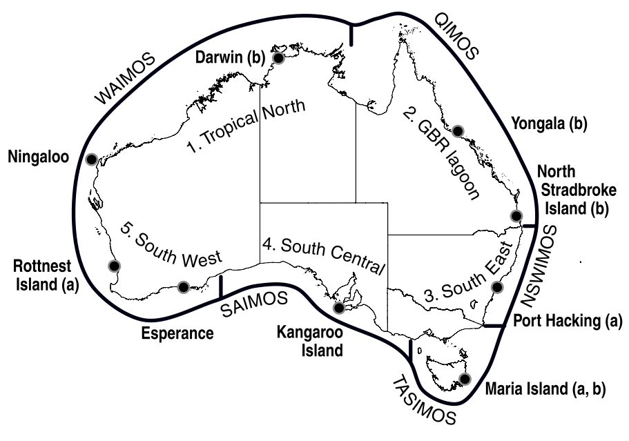
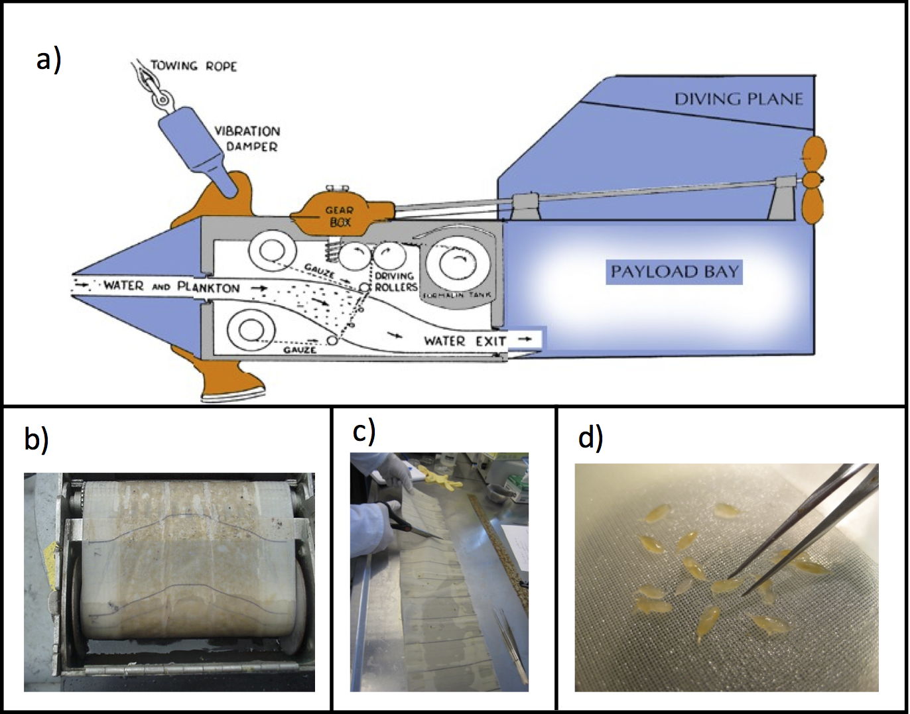
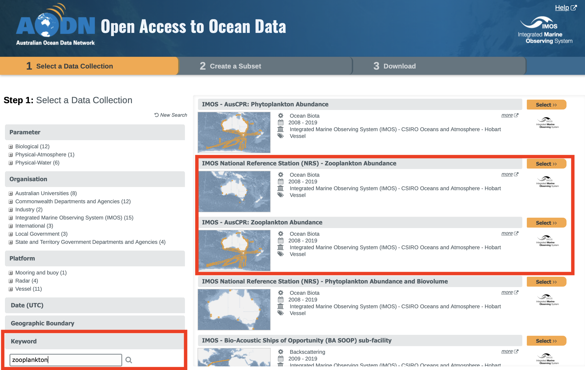
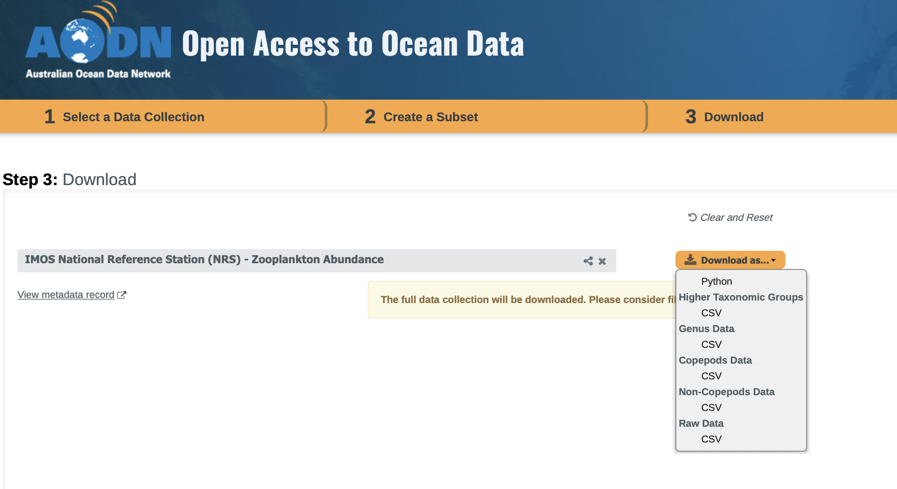

<style type="text/css">

body{ /* Normal  */
      font-size: 13pt;
  }
td {  /* Table  */
  font-size: 13pt;
}
h1.title {
  font-size: 28px;
  color: DarkRed;
}
h1 { /* Header 1 */
  font-size: 22px;
  color: DarkBlue;
}
h2 { /* Header 2 */
    font-size: 18px;
  color: DarkBlue;
}
h3 { /* Header 3 */
  font-size: 16px;
  font-family: "Times New Roman", Times, serif;
  color: DarkBlue;
}
code.r{ /* Code block */
    font-size: 13pt;
}
pre { /* Code block - determines code spacing between lines */
    font-size: 13pt;
}
</style>

 | | <span style="color:#1162a5ff; font-size:26px">How to access and use IMOS Plankton data in your Research</span>
--------------- | --- | ------------

<span style="font-size:16px;"> **Authors:** Jason Everett (UNSW, UQ), Claire Davies (CSIRO) and Anthony Richardson (UQ, CSIRO) </span>

<span style="font-size:16px;">Jason.Everett@uq.edu.au </span>
<br />
<span style="font-size:16px;">Claire.Davies@csiro.au </span>
<br />

# Accessing IMOS Zooplankton Data

There are two sources of IMOS Zooplankton data on the AODN Portal: 1) Zooplankton net samples from the National Reference Stations and, 2) Zooplankton data from the continusous Plankton Recorder, towed behind ships of opportunity. Both of these data sources are outlined in the following secion.

## IMOS National Reference Stations



The National Reference Stations collect observations of both physical and biogeochemical variables to characterise the ocean environment and to understand fundamental biological processes within the environment. Core variables observed include temperature, salinity, dissolved oxygen, nutrients, turbidity, carbon, phytoplankton, and zooplankton. 

The vessel-based sampling comprises: 1) Vertical profiling sensor measurements of conductivity (salinity), temperature and depth, oxygen, fluorometry and turbidity; 2) Niskin bottle samples at discrete 10 m intervals for measurements of total dissolved inorganic carbon, alkalinity and nutrients; 3) A combined water column sample from all Niskin bottles for phytoplankton and pigments; 4) Zooplankton samples from a plankton drop net; 5) Measurement of turbidity with a Secchi disk; and 6) Some station-specific samples (i.e. Larval Fish)


## Continuous Plankton Recorder

Water enters the Continuous Plankton Recorder (CPR) through a square aperture (1.27 cm each side), about the size of a thumbnail. It then flows down an expanding tunnel, which effectively reduces the water pressure to minimise damage to the captured plankton, and exits through the rear of the device. The movement of water past the CPR turns an external propeller at the rear of the device that operates a drive shaft and gear system, which advances the silk filtering mesh. Plankton in the water are filtered onto this constantly moving band of silk. This filtering silk meets a second band of covering silk, effectively sandwiching the plankton, and is then wound onto a spool in a storage tank containing formalin. Both phytoplankton and zooplankton are retained.



The advantage of the CPR is that it is robust and can be easily deployed and retrieved in minutes while a vessel is under way. This means that CPRs can be deployed from a range of vessels including commercial container ships and research vessels. The CPR is lowered to approximately 10 m depth, 100 m behind the vessel. Detailed descriptions of the CPR device and its sampling characteristics are summarised in Richardson et al. (2006) and Hosie et al. (2003).


## Accessing zooplankton data
The easiest way to find the zooplankton data is to go to the IMOS data portal and use the keyword search function for "zooplankton". You will see that there are zooplankton abundance data from both the CPR and NRS.



But these 2 options hide a multitude of data options which have been provided by the IMOS Plankton Team. Lets select NRS, and click through to the "Download" tab. Here you will notice 6 options for download.



1. Python - A python script to automate the download for Python users.
2. Higher Taxonomic Groups - Zooplankton data tabulated into broad taxonomic groups such as "Copepod", "Amphipod", "Salps".
3. Genus Data - Zooplankton data tabulated by Genus. 
4. Copepods Data - Copepod data tabulated by species. This is the only group for which species classification is possible across much of the diversity. For this reason it is very useful for species richness or community composition analysis.
5. Non-Copepods Data - Highest taxonomic level for all non-copepod data in table format.
6. Raw Data - This data is not tabulated (it is in long format), and contains the raw output from the database including, male/female, adult/juvenile classifications where possible. It does not contain zero's, but is the raw output of what is found in the sample. If you decide to use this data, we suggest you make contact with Claire Davies (CSIRO) before doing so, to ensure you are across all the intricacies of this dataset.


# Examining the Copepod Community

Today we are going to have a quick look at the copepod data.

Plankton, and in particular copepod species, provide ideal indicators of ecosystem health and ecological change because it is abundant, short-lived, not harvested, and sensitive to changes in temperature, acidity and nutrients. Plankton has thus been used as indicators for climate change, eutrophication,  sheries, invasive species, ecosystem health and biodiversity (Edwards et al. 2011). 

As part of the Integrated Marine Observing System (IMOS), data on copepod species composition and concomitant environmental data have been collected at nine national reference stations around Australia. Samples are collected with a vertical zooplankton net dropped to 50 m depth. We are interested in investigating whether there are unique communities at the different national reference stations, and what might be driving these differences in community structure. 

Here we will perform an MDS on the copepod community and environmental data from the IMOS National Reference Stations around Australia to answer two questions:

1. Are there different communities at the different stations? (i.e., can we sample fewer stations?)
2. If there are different communities, what environmental variables might structure these communities? 

## Wrangling the copepod data

Download the "Copepods Data" from the NRS as outlined in the previous section. 
Read the data file into a dataframe. Have a look at it to make sure it is OK.

```{r message=FALSE, warning=FALSE, results = 'hide'}

library(tidyverse) # install.packages("tidyverse")
library(lubridate) # install.packages("lubridate")
library(vegan) # install.packages("vegan")

dat <- read_csv("../../Plankton/Output/NRS_zoop_copes_mat.csv")  
```
  
```{r message=FALSE, warning=FALSE, results = 'hide'}
str(dat)

# First lets get rid of the Esperence and Ningaloo data because these stations have been stopped and there isn't as much data.
dat <- filter(dat, Station!="Esperance" & Station!="Ningaloo")
dat$Station <- as.factor(dat$Station) # Set as a factor

# In order to sped things up, lets just lookk at the last 5 years worth of data
dat <- filter(dat,Year >= 2015 & Year <= 2020)

# Lets create a community matrix on which to run the mds
com <- select(dat, `Acartia (Acanthacartia) fossae`:`Undinula vulgaris`)
com # Displays the community matrix – it’s BIG!

# Some of the taxa in the database do not have any counts because they are not present in this dataset. We need to remove them
com2 <- select(com, which(!colSums(com, na.rm=TRUE) %in% 0))

taxaSum <- colSums(com2) # Take the sum of each column (taxa). There should be no 0 for a species now.
min(taxaSum)
```


First, let’s look at the range of the data.

```{r message=FALSE, warning=FALSE, results = 'hide'}
summary(com2)
```

So there are three orders of magnitude difference in the values. That means the abundant species will swamp the effect of rare species. Let’s try a `sqrt()` transformation.

```{r message=FALSE, warning=FALSE, results = 'hide'}
transcom <- sqrt(com2)
```

## Running the MDS
Next we need to conduct the MDS using the Bray-Curtis measure of dissimilarity. 
```{r message=FALSE, warning=FALSE, results = 'hide'}
comMDStrans <- metaMDS(com2, distance = "bray", autotransform = TRUE, k= 2, maxit=1000, try = 20, trymax = 50)
```

Then we can plot it by setting up a palette, plotting it, adding a legend:
```{r message=FALSE, warning=FALSE, results = 'hide'}
Pal <- c("red", "green", "brown", "orange", "lightblue", "purple", "black") # Define the palette
plot(comMDStrans$points, pch = 16, col = Pal[as.numeric(dat$Station)])
legend('topleft', legend = levels(dat$Station), pch = 16, col = Pal, cex = 0.6, y.intersp = 0.7)
```

## Adding Environmental Data

Now let’s look at the relationship with environmental data. I have provided you with a file of satellite temperature and chlorphyll a (proxy for phytoplankton biomass). First we need to load it and then merge it with our community dataframe.

```{r message=FALSE, warning=FALSE, results = 'hide'}
enviro <- read_csv("../../Plankton/Output/NRS_Indices.csv") # Load the data
summary(enviro) # Check it all looks ok.
```
There will be a few NaNs due to satellite coverage. We can live with that, as long as there aren't too many. Lets merge the new dataset with the original dat frame. That way we know that the order of data will be the same, and it will be in the same dataframe as the location and time data.

```{r message=FALSE, warning=FALSE, results = 'hide'}

#To avoid duplicates, we remove some variables from enviro first
enviro <- select(enviro, -c("Station", "Latitude", "Longitude", "SampleDateLocal", "Year", "Month", "Day", "Time_24hr")) 

# Join the enviro data with the copepod data
dat2 <- left_join(dat,enviro, by = c("NRScode"))
```

We can overlay a surface for different environmental variables on the MDS for transformed data. The function `ordisurf()` fits a smooth surface using spline smoothers in `gam()`.
  
```{r message=FALSE, warning=FALSE, results = 'hide'}
comMDStrans <- metaMDS(transcom, distance = "bray", autotransform = FALSE, k= 2, maxit=1000, try = 20, trymax = 50) # You don't need to rerun this if its still in your environment.
plot(comMDStrans$points, pch = 16, col = Pal[as.numeric(dat2$Station)])
legend('topleft', legend = levels(dat2$Station), pch = 16, col = Pal, cex = 0.6, y.intersp = 0.7)

ordisurf(comMDStrans, dat2$CTD_SST_C, add = TRUE, col = "blue")
ordisurf(comMDStrans, dat2$Chla_mgm3, add = TRUE, col = "green")
ordisurf(comMDStrans, dat2$Latitude, add = TRUE, col = "red")

```

The plot is pretty messy. Why not go back and re-plot the MDS and then overlay only one environmental variable at a time. 

What would be useful though is to test the significance of the environmental variables. This is where the function `envfit()` comes in. This function fits environmental vectors or factors onto an ordination, effectively assessing which environmental variables are most important for structuring the community. 

Let’s try the `envfit()` on the transformed data:
```{r message=FALSE, warning=FALSE, results = 'hide'}
ord.fit.trans <- envfit(comMDStrans ~ Station + Latitude + Longitude + CTD_SST_C + Chla_mgm3, data = dat2, na.rm=TRUE, perm = 1000)
ord.fit.trans
```

The `envfit()` shows that the most significant variables (in order of importance) are `Latitude`, `Longitude`, `Station`, `Chlorophyll` and `SST`.

The conventional way of showing the results of `envfit()` is to plot the vectors of the continuous environmental variables (which have maximum correlation with the points), and the average of the factor levels.

```{r message=FALSE, warning=FALSE, results = 'hide'}
plot(comMDStrans$points, pch = 16, col = Pal[as.numeric(dat$Station)])
legend('topleft', legend = levels(dat$Station), pch = 16, col = Pal, cex = 0.6, y.intersp = 0.7)
plot(ord.fit.trans)
```

# Trends in Zooplankton and Phytoplankton data at the NRSs

IMOS has convened a Task Team to contribute to an assessment report of the state and trends of Australia’s pelagic ecosystems (see http://imos.org.au/facilities/task-teams/star/). Because of our ocean observing experience spanning physics to biology, the IMOS community is uniquely placed to deliver such an assessment. 

The opportunity here is to value-add to the information collected by IMOS – and other time series collected in Australia – by translating data into time series of ecosystem indicators that describe the state and trends of our pelagic environment. The target audience for the assessment report is policy makers, marine managers, and fellow scientists.

The IMOS Plankton Team is contributing heavily to this task team, and the analysis below is one example of the use of the IMOS phytoplankton and zooplankton data from the National Reference Stations.

## Phytoplankton and Zooplankton Biomass

TODO - Add in some trend analysis of biomass data from the updated SoE data.


# Further Reading

Hays, G., A. Richardson, and C. Robinson. 2005. Climate change and marine plankton. Trends in Ecology & Evolution 20(6):337–344.

Kwiatkowski, L., O. Aumont, and L. Bopp. 2018. Consistent trophic amplification of marine biomass declines under climate change. Global Change Biology 25(1):218–229.

McQuatters-Gollop, A., A. Atkinson, A. Aubert, J. Bedford, M. Best, E. Bresnan, K. Cook, M. Devlin, R. Gowen, D. G. Johns, M. Machairopoulou, A. McKinney, A. Mellor, C. Ostle, C. Scherer, and P. Tett. 2019. Plankton lifeforms as a biodiversity indicator for regional-scale assessment of pelagic habitats for policy. Ecological Indicators 101:913–925.

Molinos, J. G., D. S. Schoeman, M. T. Burrows, E. S. Poloczanska, C. J. Brown, S. Ferrier, T. D. Harwood, C. J. Klein, E. McDonald-Madden, P. J. Moore, J. M. Pandolfi, J. E. M. Watson, A. S. Wenger, and A. J. Richardson. 2018. Climate Velocity Can Inform Conservation in a Warming World. Trends in Ecology & Evolution 33(6):441–457.

Richardson, A. J. 2008. In hot water: zooplankton and climate change. ICES Journal of Marine Science 65(3):279–295.